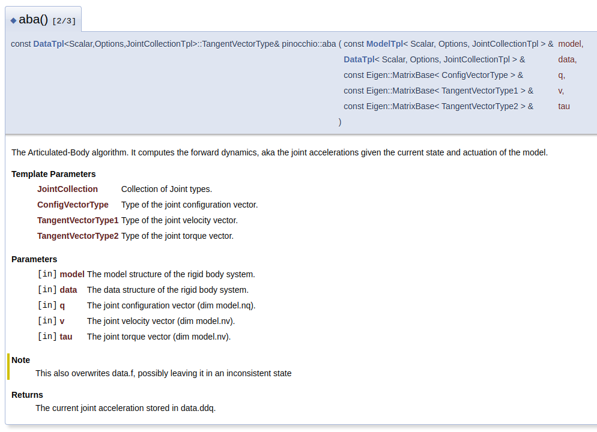
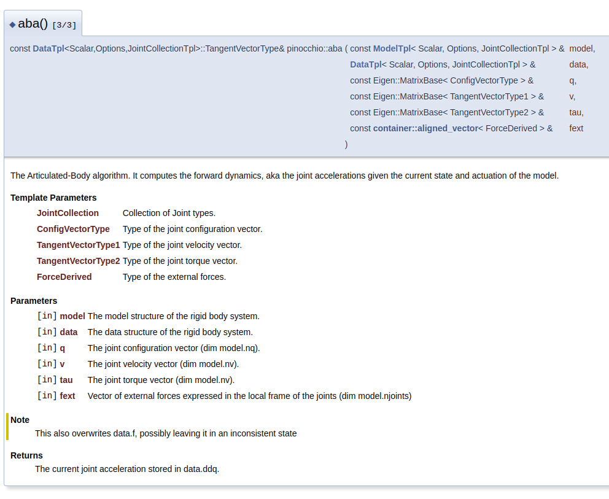
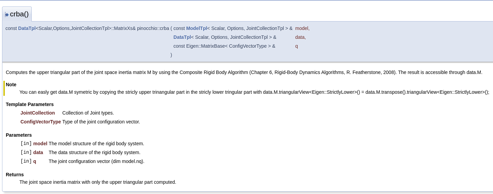
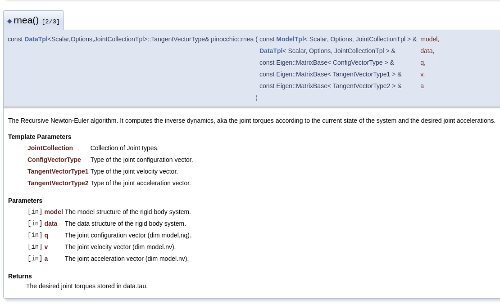
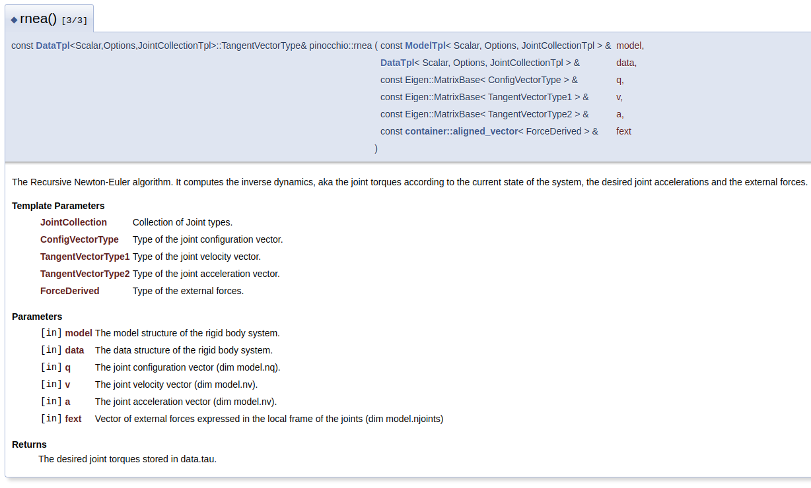

# Overiview #

Here I will gather information, mostly about physicis and pinocchio, necessary to my diploma.

## Physics ##

### Eqasion of motion ###

*Def.* The equasion of motion
$$
\tau = H(q)\ddot{q} + c(q, \dot{q}, f_{ext})
$$
where $H(q)$ is joint space inertia matrix and $c(q, \dot{q}, f_{ext})$ is joint space bias force.

### Centroidal momentum matrix ###

*Def.* The centroidal momentum is the stack of linear and angular momentum of the system expressed around center of mass.

*Def.* The centroidal momentum matrix is matrix that transforms generalized coordinates of the system into the centroidal momentum.
$$
\begin{bmatrix} P\\ L \end{bmatrix} = A \dot{q}
$$

## Pinocchio ##

### ABA ###

Alrotihm is used to compute accelerations corresponding to current configuration and applied torques.

### CRBA ###

Algorith is used to compute joint-space inertia matrix.

### RNEA ####

Algorithm is used to compute torques required to get desired accelerations.

## References ##

### Issues ###

- [explanation model nq and nv](https://github.com/stack-of-tasks/pinocchio/issues/735)
- [pinocchio concepts (applied to jacobian computations)](https://github.com/stack-of-tasks/pinocchio/issues/735)
- [floating base](https://github.com/stack-of-tasks/pinocchio/issues/1593)
- [external forces](https://github.com/stack-of-tasks/pinocchio/issues/632)

### Stackoverflow ###

- [how to deal with dimensions when implementing pd controller for robot with floating base](https://stackoverflow.com/questions/72143956/pydrake-pid-control-of-free-floating-simulation-velocity-positional-dimensi)

### Papers ###

- [momentum control for balance](https://www.cs.ucr.edu/~cshelton/papers/docs/balance09.pdf)

### Thesis ###

- [thesis](https://www.macchietto.com/papers/thesis.pdf)
